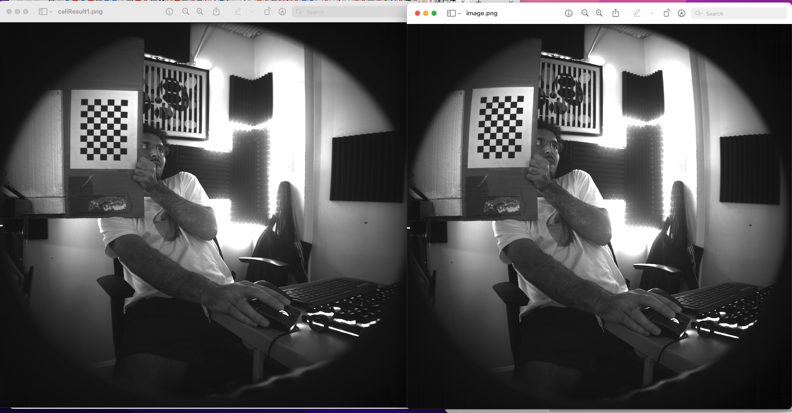

# Camera_Calibration

Technology is improving and getting cheaper each day. We can buy good quality cameras cheaper and use them for different purposes. But there is a downside with mass production cameras, they are not perfect after the build process. The precision is not enough and they need to be calibrated to extract meaningful data if we will use them for Vision purposes.

OpenCV library gives us some functions for camera calibration. Before starting, we need a chessboard for calibration. It should be well printed for quality. Please don’t fit it to the page, otherwise, the ratio can be wrong. The key is that we will know each square size and we will assume each square is equal! There are different boards for calibration but chessboard is the most used one
